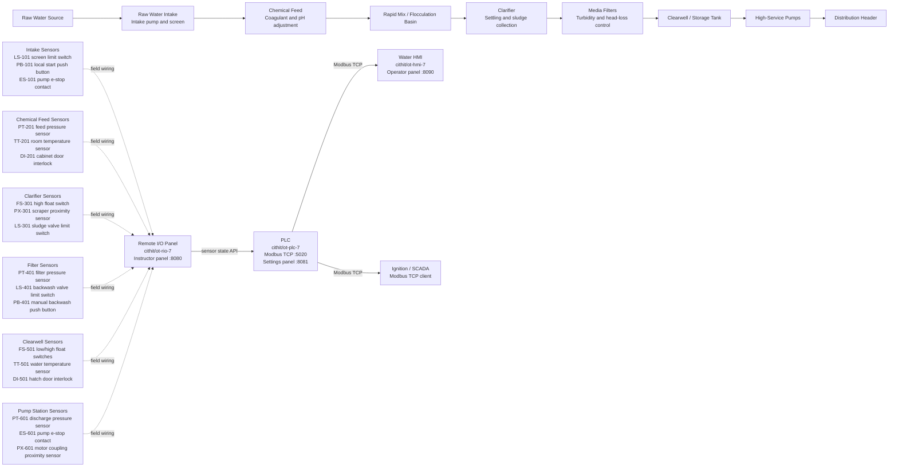
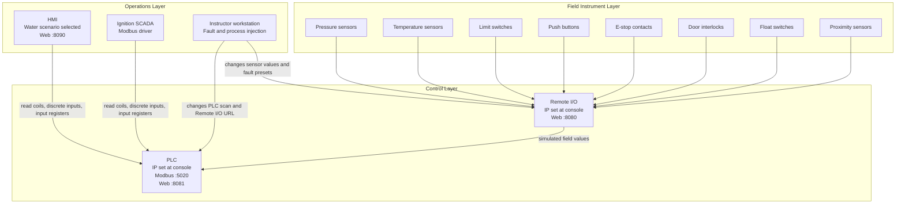

# Water Treatment Plant OT Diagram

This diagram gives the GNS3 lab a water treatment plant scenario using the existing PLC, Remote I/O, and HMI containers. It shows where the simulated field sensors belong in the process and how those signals move through the OT network.

## Process And Sensor Layout



## OT Network View



## Suggested I/O Map

The existing containers already expose a starter Modbus map. These tags can be reused for the water treatment scenario or expanded as more points are added.

| Water plant signal | Sensor type | Container point | Modbus area | Reference |
| --- | --- | --- | --- | --- |
| High-service pump run command | Output coil | `pump_run_cmd` | Coil | `000001` |
| Plant alarm active | Output coil | `alarm_active` | Coil | `000002` |
| Local pump start | Push button | `start_pb` | Discrete Input | `100001` |
| Pump e-stop healthy | E-stop contact | `estop_ok` | Discrete Input | `100002` |
| Pump room door closed | Door interlock | `door_closed` | Discrete Input | `100003` |
| Clearwell high level | Float switch | `tank_high` | Discrete Input | `100004` |
| Discharge pressure | Pressure sensor | `pressure` | Input Register | `300001`, scaled x10 |
| Water or room temperature | Temperature sensor | `temperature` | Input Register | `300002`, scaled x10 |

## Instructor Scenario Ideas

The Remote I/O instructor panel can drive common water treatment faults:

- Increase ambient temperature in the pump room to test cooling and alarm response.
- Dramatically increase discharge or filter pressure to simulate a blocked outlet or fouled filter.
- Open a door interlock during operation to test safety permissives.
- Trip an e-stop contact to verify pump shutdown logic.
- Force a float switch high or low to simulate a clearwell level problem.
- Toggle a proximity sensor to simulate rotating equipment feedback loss.
- Toggle limit switches to simulate a stuck valve or failed position indication.

## GNS3 Placement

Use one Docker appliance per OT role:

| Device | Docker image | Primary lab purpose | Student-facing URL |
| --- | --- | --- | --- |
| PLC | `cithit/ot-plc-7:latest` | Ladder-style scan and Modbus TCP server | `http://<plc-ip>:8081` |
| Remote I/O | `cithit/ot-rio-7:latest` | Field sensor selection and instructor faults | `http://<rio-ip>:8080` |
| HMI | `cithit/ot-hmi-7:latest` | Water treatment operator screen | `http://<hmi-ip>:8090` |

For a simple /24 lab network, assign the containers from the console prompt, for example:

```text
PLC:        192.168.1.2/24
Remote I/O: 192.168.1.3/24
HMI:        192.168.1.4/24
Ignition:   192.168.1.10/24
```

In the HMI, select the Water scenario and enter the PLC as either the full IP address, such as `192.168.1.2`, or the last octet, such as `2`, when the HMI is on the same /24 network.
